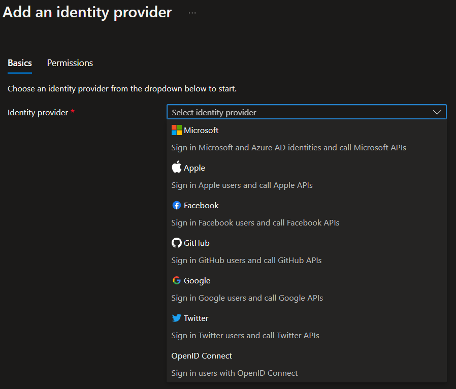
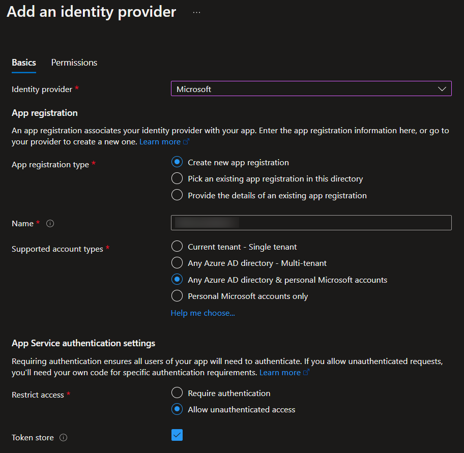
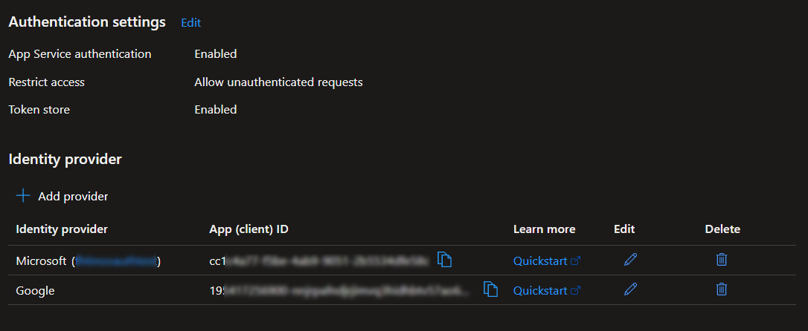
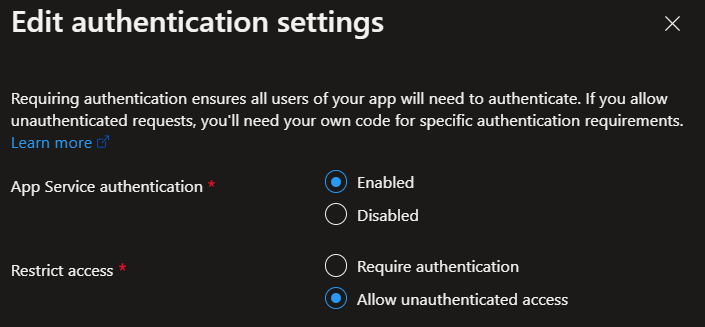
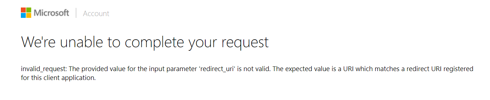
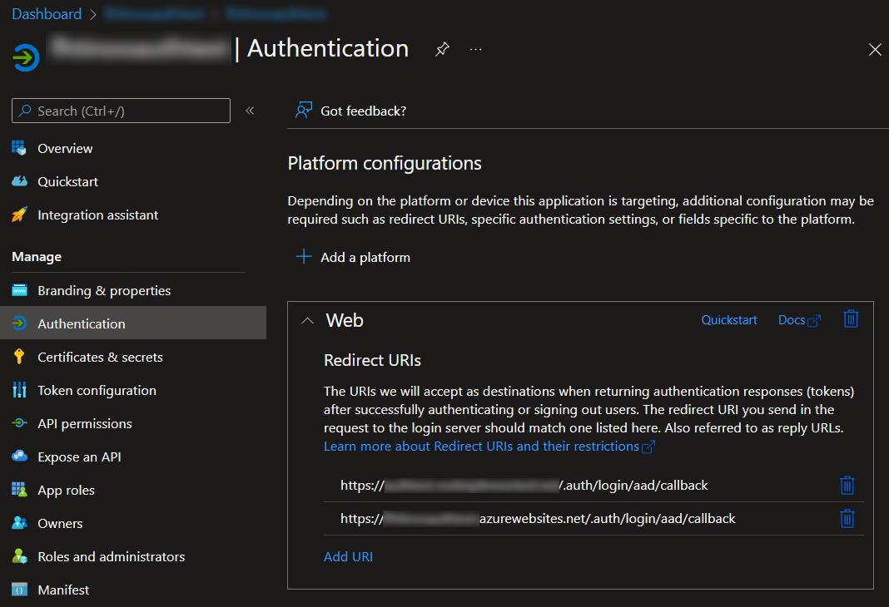
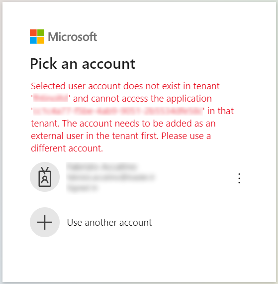
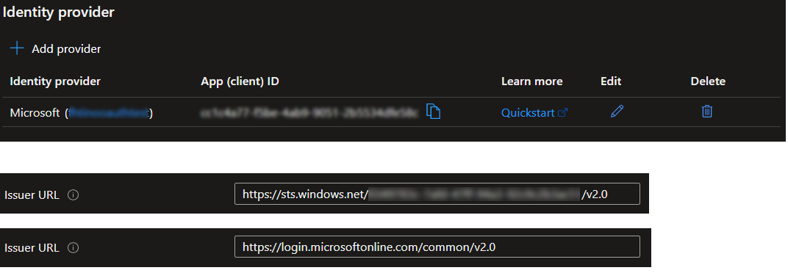
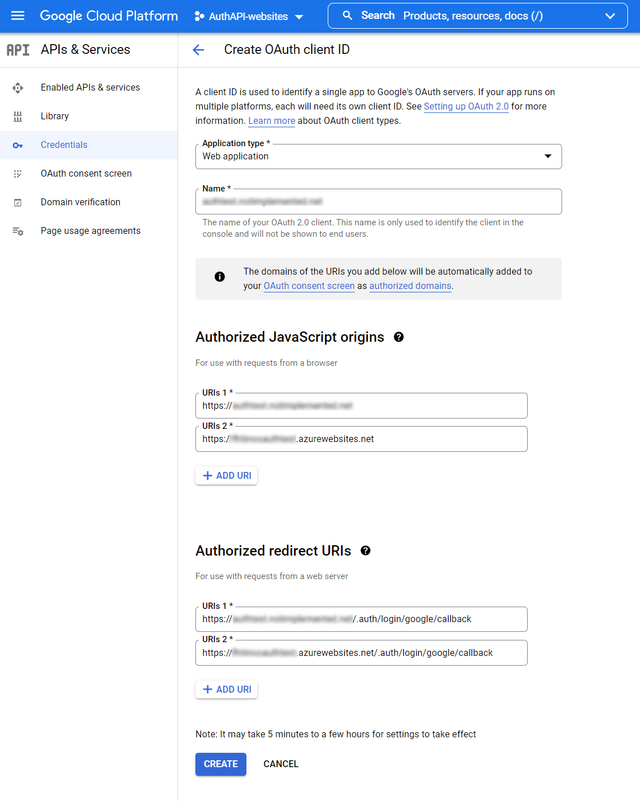
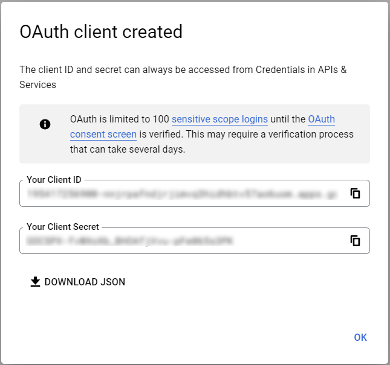

# Asp.Net (framework) and App Servive Authentication

*Protecting an Asp.Net framework web site using Azure App Service authentication, AKA "EasyAuth".* 

<br/>

Web applications deployed in Azure App Service can be protected with different technique. The easiest to use is the integrated App Service Authentication also known as “Easy Auth” [[Link]](https://docs.microsoft.com/en-us/azure/app-service/overview-authentication-authorization)
With some clicks, without modifying the running application and in just few minutes,
it is possible to protected a web site activating authentication based on different providers: Microsoft Identity, Google, Facebook, Twitter, etc.

<p align="center"></p>

<br/>

This walkthrough will show how to protect a web-site, add roles management, allow public access to some area and restrict access to reserved ones. It will also propose a solution for working and developing locally without EasyAuth.

Steps:
 - activate EasyAuth on an existing and deployed web-application
 - modify the application to accommodate auto-redirect for non authenticated users
 - modify the application to inject roles
 - modify the application to simulate EasyAuth locally


## Activate EasyAuth

Select the App Service --> Authentication --> Add Identity provider\
Depending on the choosen provider, select the appropriate options. In this case, Microsoft is configured to allow authentication of user from any Azure tenant and personal Microsoft account (see note below for details and tips). After confirming, an App will be created in the current Azure Active Directory. Other providers have different options.

<p align="center"></p>

The configuration panel after adding Microsoft and Google providers:

<p align="center"></p>

The EasyAuth can be configured to force authentication on the whole web-site or to allow even unauthenticated users. The latter is useful if the web-site has both public/anonymous pages and protected areas.

<p align="center"></p>


### Custom domain

If the App Service uses a custom domain, the linked Azure AD application must be updated to allow redirects to the custom domain, too.

<p align="center"></p>

Add `https://<my-web-site-custom-domain>/.auth/login/aad/callback` alongside the existing one `https://<myappservice>.azurewebsites.net/.auth/login/aad/callback` to solve the issue.

<p align="center"></p>


### Notes about Microsoft provider

Microsoft Identity provider has an undocumented - as far as I know - option that is foundamental to allow smooth login to users coming from other Azure tenants. The default Issuer URL is in the form
`https://sts.windows.net/<your_tenant_id>/v2.0` allowing to authenticate users belonging to that tenent. Other tenants users get error like "selected user does not exist in tenant [aaaa]... The account needs to be added as an extenal user in the tenant first."

<p align="center"></p>

To autheticate all Microsoft accounts and tenants, change the Issuer URL to `https://login.microsoftonline.com/common/v2.0`

<p align="center"></p>


### Notes about Google

Before activating the provider on Easy Auth, a credential must be created under Google Developer console. Add the required url and then [create]. The Cliend ID and Secret must be copied into the form for Google provider in Azure.

<p align="center"></p>

<br/>

<p align="center"></p>


## Web application modifications for a better integration

The following modifications, local-fake-authenticator and demo-roles-injector works on bare asp.net framework. No additional library required nor Owin.


### Login page

The ReturnUrl parameter comes as a GET parmameter after a redirect because of a 401 error (see following section).

Login.aspx

```html
<ul>
    <li><a href="/.auth/login/aad?post_login_redirect_url=<%=ReturnURL%>">Microsoft Identity Platform</></li>
    <li><a href="/.auth/login/google?post_login_redirect_url=<%=ReturnURL%>">Google</a></li>
    <li><a href="login_fake.aspx?post_login_redirect_url=<%=ReturnURL%>">Local-Fake</a></li>
</ul>
```


### Auto redirect to login page

Global.asax

```csharp
protected void Application_EndRequest(object sender, EventArgs e)
{
    if (Response.StatusCode == (int)System.Net.HttpStatusCode.Unauthorized)
    {
        Response.Redirect("~/login.aspx?returnurl=" + Server.UrlEncode(Request.Url.PathAndQuery));
    }
}
```

### Soft and hard logout

Standard EasyAuth URL is `https://mysite/.auth/logout`
With Microsoft provider, this page logs out the Microsoft account completelly, resulting the user logged out from all sites using Microsoft authentication. Normally this is not what user wants; they just want to logout from current web-site. To accomplish that, the "soft" logout page deletes the cookie `AppServiceAuthSession`, where EasyAuth stores authentication information.

```csharp
[Logout.aspx]
Response.Cookies.Add(
    new HttpCookie("AppServiceAuthSession")
    {
        Value = "",
        Expires = DateTime.UtcNow.AddDays(-1)
    });
Response.Redirect("~/");
```

### Roles injection

Asp.net framework has a build-in support for roles authorization. It can be activated modifying the root web.config or a local web.config in a subfolder. This will protect the site or subfolder.

```xml
[Web.config]
<configuration>
  <system.web>
	  <authorization>
		  <allow roles="admins"/>
		  <deny users="*"/>
		  <deny users="?"/>
	  </authorization>
  </system.web>
</configuration>
```

Users coming from EasyAuth do not have Roles information. The authentication provider has no information about user's roles in a particular web-application. So, roles must be managed locally, by the web-application. They can be easily injected in `Application_PostAuthenticateRequest`. In the sample application, the users roles are stored in the web.config for demonstration purpose. Real applications will store them in a data-store (sql database or similar) and should use a cache system to avoid continous calls to the data-storage.

```csharp
[Global.asax]
protected void Application_PostAuthenticateRequest(object sender, EventArgs e)
{
    FakeRoles.AddRoles(ClaimsPrincipal.Current.Identity as ClaimsIdentity);
}
```

```csharp
[FakeRoles.cs]
public static void AddRoles(ClaimsIdentity claimsIdentity)
{
    ...
    foreach (var role in roles)
    {
        claimsIdentity.AddClaim(new Claim(claimsIdentity.RoleClaimType, role));
    }
    ...
}
```

### Fake local authentication

Currently there is no way to use EasyAuth locally, when developing with Visual Studio. As a work-around, a fake user can be injected in Application_AuthenticateRequest.

```csharp
[Global.asax]
protected void Application_AuthenticateRequest(object sender, EventArgs e)
{
    FakeLocalAuth.InjectIfRequired(HttpContext.Current);
}
```

```csharp
[FakeLocalAuth]
private static string EasyAuthCookieName = "AppServiceAuthSession";
private static string EasyAuthCookieFakeValue = "***fake***";
public static void SetCookie(HttpContext ctx)
{
    if (IsActive(ctx))
    {
        ctx.Response.Cookies.Add(new HttpCookie(EasyAuthCookieName, asyAuthCookieFakeValue));
    }
}
public static void InjectIfRequired(HttpContext ctx)
{
    if (IsActive(ctx))
    {
        if (ctx.Request.Cookies[EasyAuthCookieName]?.Value == EasyAuthCookieFakeValue)
        {
            var claims = new List<Claim>()
            {
                new Claim(ClaimTypes.Name, "LocalDev_name"),
                new Claim(ClaimTypes.NameIdentifier, "localdev"),
                new Claim(ClaimTypes.Email, "localdev@dev.localhost"),
                new Claim(ClaimTypes.Surname, "Developer"),
                new Claim(ClaimTypes.GivenName, "Local-developer"),
                new Claim("http://schemas.microsoft.com/accesscontrolservice/2010/07/laims/identityprovider", "Local temp ASP.NET Identity"),
            };
            var claimsIdentity = new ClaimsIdentity(claims, "LocalFakeAuthenticator");
            ctx.User = new ClaimsPrincipal(claimsIdentity);
        }
    }
}
```


